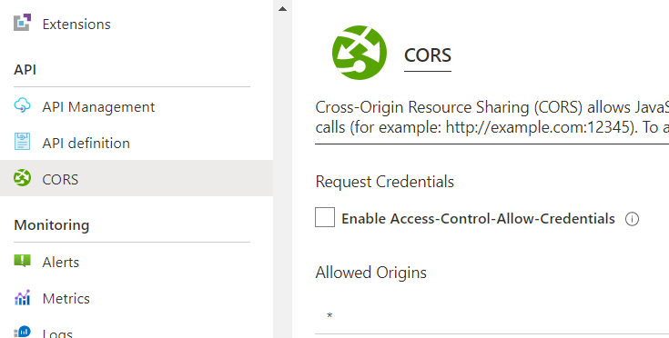
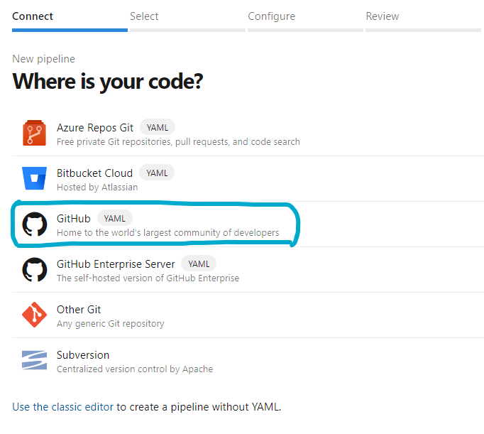
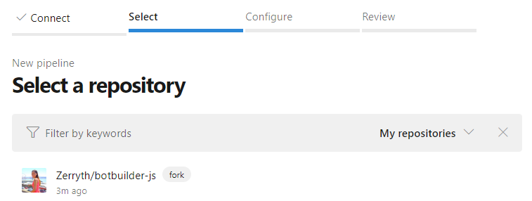
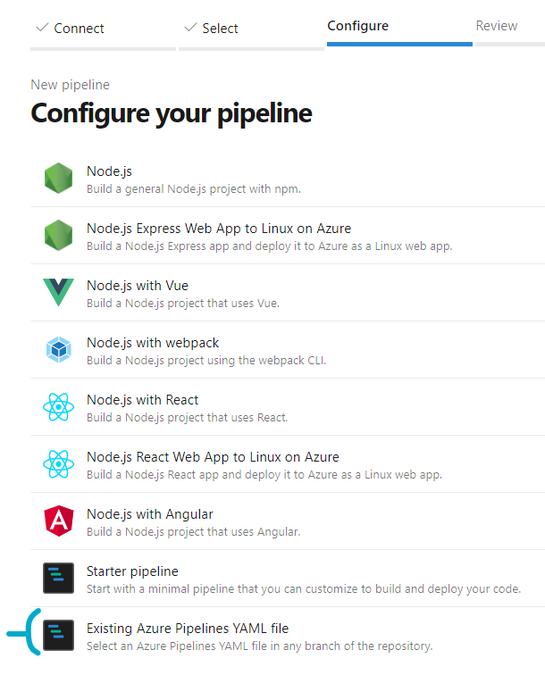
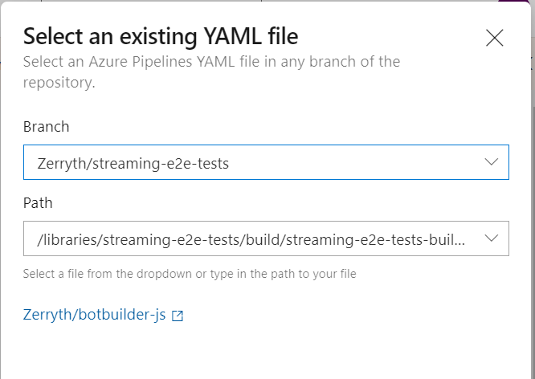
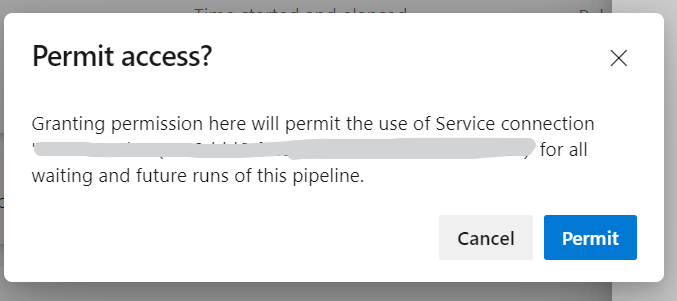
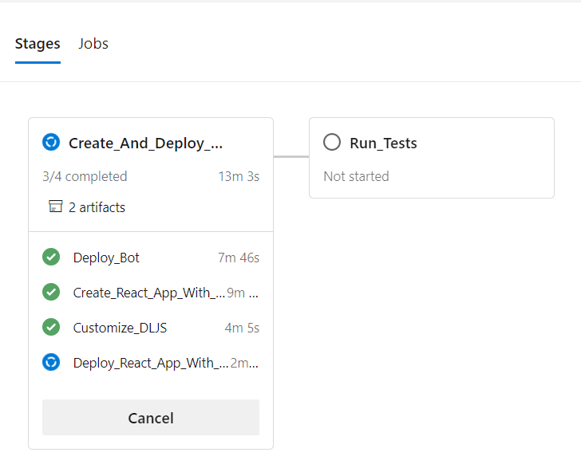

# End-to-End Streaming Tests Automation

## Description
The `streaming-e2e-tests` library automates the testing of `botframework-streaming`'s compatibility with different browsers. These tests provision, deploy, and run all components involved in streaming through an Azure DevOps Pipeline.

*End-to-End Streaming Tests Architecture*

## Further Details on Test Setup
The project consists of two projects that get deployed (the [bot](#the-bot) and the [react app](#the-react-app)) and the [tests](#browser-tests-automation) themselves. To automate testing in the browser, the tests use [Selenium WebDriver](https://www.selenium.dev/documentation/en/webdriver/understanding_the_components/) to communicate to various browsers.

### The Bot
- The bot is built leveraging botframework-streaming. It is deployed to a DirectLine App Service Extension-enabled (DL ASE) App Service in Azure, as part of the DevOps Pipeline process.
- See documentation on [how to configure a bot to use DL ASE](https://docs.microsoft.com/en-us/azure/bot-service/bot-service-channel-directline-extension-node-bot?view=azure-bot-service-4.0).
- As part of the E2E testing pipeline, the suite ensures that the bot uses the latest botframework-streaming preview version (the "daily") before deploying the bot and running the tests.

### The React App
- To test the compatibility of using streaming in the browser with a [webpack](https://webpack.js.org/)ed project, the DevOps Pipeline provisions a brand new React app (`npx create-react-app`).
- Subsequently the React App uses a customized DirectLineJS (DLJS)
    - To test streaming in browsers, we customize DLJS to use the latest botframework-streaming version
- To provide an interface that a user could actually manually go to themselves to test talking to a streaming bot manually, we use WebChat to as a channel in the React App

### Browser Tests Automation
- To automate testing in browsers, the E2E tests use Selenium WebDriver.
- The WebDriver communicates to browser-specific drivers (e.g. ChromeDriver for Chrome) to automate interactions in the browser, or "drive" the browser

### Running the Pipeline
Running the pipeline will:
- **Provision & Deploy Projects**:
    - **Bot**: point bot to use the daily build of botframework-streaming (latest preview version)
    - **React App**:
        - Provision a brand new react app via `npx create-react-app` command
        - Set up the React app to use WebChat (`ReactWebChat`)
        - Install a custom version of DirectLineJS (DLJS) into the app
            - Configures DLJS to use the latest botframework-streaming preview version
- **Run Tests**
    - Downloads the browser-appropriate Driver necessary for Selenium WebDriver to automate testing in a browser (Chrome)
    - Runs the tests that have React and bot talk to each other

# How to Run the Tests
These tests were built so that the SDK team can routinely run these E2E tests automatically and ensure the compatibility of botframework-streaming and the browser. It does so by deploying the bot and React app to already-provisioned resources in the [Azure portal](https://ms.portal.azure.com/) that have been configured to enable DL ASE. If you wish to run these tests yourself, you must provision resources in your own Azure subscription first before you can run the automated pipeline built by the YAMLs included in the streaming-e2e-tests library.

You can provision the resources by simply deploying an [echo-bot sample](https://github.com/microsoft/BotBuilder-Samples/tree/master/samples/javascript_nodejs/02.echo-bot) via [zip-deployment](https://docs.microsoft.com/en-us/azure/bot-service/bot-builder-deploy-az-cli?view=azure-bot-service-4.0&tabs=javascript) or you could create each bot-related resource manually in the Azure portal.
    - Then configure your resources to [enable DL ASE](https://docs.microsoft.com/en-us/azure/bot-service/bot-service-channel-directline-extension-node-bot?view=azure-bot-service-4.0).
    - App Service CORS configuration: in your bot's App Service, on the left-hand side under CORS, you'll need to add your React app's website under Allowed Origins to allow it to access your bot, or simply clear all origins and add `*` to allow all domains. 

## Azure DevOps Pipeline Configuration
The following steps guide you through the configuration of a build pipeline based on YAML file.

### Prerequisites
- Azure DevOps organization. You can find documentation [here](https://docs.microsoft.com/en-us/azure/devops/organizations/accounts/create-organization?view=azure-devops).
- Azure subscription. 

1. Create a pipeline in Azure DevOps.
    
    

2. Select GitHub YAML for code source.
    
    

3. Configure the repository and branch. Use [`botbuilder-js/libaries/streaming-e2e-tests/streaming-e2e-tests-build.yml`](https://github.com/microsoft/botbuilder-js/blob/Zerryth/streaming-e2e-tests/libraries/streaming-e2e-tests/build/streaming-e2e-tests-build.yml) as the root YAML of this pipeline.
    

        
Configuration Screen Shots

    
    - Select a GitHub repo that your Azure Pipeline will sync with. 
    
    
    - Select the option of "Existing Azure Pipelines YAML file" 
    
    - Select branch of the repo you want to sync with. For "Path" write the path to the [`streaming-e2e-tests-build.yml`](https://github.com/Zerryth/botbuilder-js/blob/Zerryth/streaming-e2e-tests/libraries/streaming-e2e-tests/build/streaming-e2e-tests-build.yml) file, which will be the "root"/"main" YAML to this testing pipeline. 
    

4. Add pipeline variables.
    - 
    - Add the following variables to your pipeline, with the appropriate values.
        - 
 
            
Variables to Include in Pipeline

            - **BotName**: name of bot
            - [**ConnectedServiceNameARM**](https://docs.microsoft.com/en-us/azure/devops/pipelines/library/service-endpoints?view=azure-devops&tabs=yaml#create-a-service-connection)
            - [**MyGetPersonalAccessToken**](https://docs.github.com/en/github/authenticating-to-github/creating-a-personal-access-token)
            - **ResourceGroup**: the resource group that contains both bot and React app in Azure portal
        

5. After saving the pipeline variables, click "Run" to create the new pipeline and instantly run it.

6. **If this is the first time you are running this pipeline, you will need to authorize the pipeline to access the service connection to edit resources in your Azure subscription automatically.**
    - When the pipeline gets to the deployment step, it will prompt that it needs permission to access the Azure subscription via service connection (click "View"). Permit the access to continue running the pipeline.
    
    

From here, you can see the pipeline running in Azure DevOps.

As you push changes to the repo/branch that the pipeline is connected to, you may manually run pipeline to test your changes.
___

*Note: ChromeDriver is the Driver specific to Chrome. For automated tests in other browsers, you will need to pair it to the appropriate Driver specific to that browser. Most Drivers are created by the browser vendors themselves. See Selenium [Driver requirements](https://www.selenium.dev/documentation/en/webdriver/driver_requirements/) for more details. 
